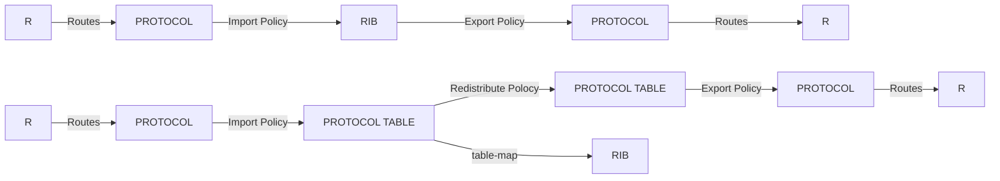
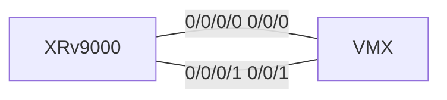

# 3.Protocol Independent Routing and VRFs

Route Policy For JUNOS/IOS




Test Topology




------


##  1. About IP routing

   **IOS XR routing tables**


路由表可以使用AFI SAFI过滤 如ipv4 unicast


**administrative distance (preference)**

通过多个来源收到相同路由时，用于选择活动路由，数字越小越优先
| protocol                     | value|
|------------------------------|------|
| directly connected interface | 0    |
| static route                 | 1    |
| DMNR                         | 3    |
| EIGRP (summary route)        | 5    |
| eBGP                         | 20   |
| EIGRP (internal route)       | 90   |
| IGRP                         | 100  |
| OSPF                         | 110  |
| IS-IS                        | 115  |
| RIP                          | 120  |
| EGP                          | 140  |
| ODR                          | 160  |
| EIGRP (external route)       | 170  |
| iBGP                         | 200  |
| Unknown                      | 255  |


**查看路由表**

路由表可以使用AFI SAFI过滤 如ipv4 unicast ，以下均以ipv4 unicast为例子

查看RIB（仅最优路由）

```
RP/0/RP0/CPU0:R1-XR(config)#do show route ipv4 unicast 
Fri Nov  1 04:50:55.224 UTC

Codes: C - connected, S - static, R - RIP, B - BGP, (>) - Diversion path
       D - EIGRP, EX - EIGRP external, O - OSPF, IA - OSPF inter area
       N1 - OSPF NSSA external type 1, N2 - OSPF NSSA external type 2
       E1 - OSPF external type 1, E2 - OSPF external type 2, E - EGP
       i - ISIS, L1 - IS-IS level-1, L2 - IS-IS level-2
       ia - IS-IS inter area, su - IS-IS summary null, * - candidate default
       U - per-user static route, o - ODR, L - local, G  - DAGR, l - LISP
       A - access/subscriber, a - Application route
       M - mobile route, r - RPL, t - Traffic Engineering, (!) - FRR Backup path

Gateway of last resort is not set

C    1.1.1.0/24 is directly connected, 4w0d, GigabitEthernet0/0/0/0
L    1.1.1.1/32 is directly connected, 4w0d, GigabitEthernet0/0/0/0
C    2.2.2.0/24 is directly connected, 4w0d, GigabitEthernet0/0/0/1
L    2.2.2.1/32 is directly connected, 4w0d, GigabitEthernet0/0/0/1
B    22.22.22.22/32 [20/0] via 2.2.2.2, 00:03:25
```

查看RIB（非最优路由）

```
RP/0/RP0/CPU0:R1-XR(config)#do show route ipv4 unicast backup 
Fri Nov  1 04:51:54.889 UTC

Codes: C - connected, S - static, R - RIP, B - BGP, (>) - Diversion path
       D - EIGRP, EX - EIGRP external, O - OSPF, IA - OSPF inter area
       N1 - OSPF NSSA external type 1, N2 - OSPF NSSA external type 2
       E1 - OSPF external type 1, E2 - OSPF external type 2, E - EGP
       i - ISIS, L1 - IS-IS level-1, L2 - IS-IS level-2
       ia - IS-IS inter area, su - IS-IS summary null, * - candidate default
       U - per-user static route, o - ODR, L - local, G  - DAGR, l - LISP
       A - access/subscriber, a - Application route
       M - mobile route, r - RPL, t - Traffic Engineering, (!) - FRR Backup path

C    1.1.1.0/24 is directly connected, 4w0d, GigabitEthernet0/0/0/0
                 Backup  i L1 [115/20] via 1.1.1.2, GigabitEthernet0/0/0/0
B    22.22.22.22/32 [20/0] via 2.2.2.2, 00:04:25
                 Backup  i L1 [115/10] via 1.1.1.2, GigabitEthernet0/0/0/0
```

查看单协议路由表（以IGP/BGP为例）：

```
RP/0/RP0/CPU0:R1-XR(config)#do show isis ipv4 unicast  route 
Fri Nov  1 04:54:01.677 UTC

IS-IS 0 IPv4 Unicast routes

Codes: L1 - level 1, L2 - level 2, ia - interarea (leaked into level 1)
       df - level 1 default (closest attached router), su - summary null
       C - connected, S - static, R - RIP, B - BGP, O - OSPF
       E - EIGRP, A - access/subscriber, M - mobile, a - application
       i - IS-IS (redistributed from another instance)

Maximum parallel path count: 8

C  1.1.1.0/24
     is directly connected, GigabitEthernet0/0/0/0
L1 22.22.22.22/32 [10/115]
     via 1.1.1.2, GigabitEthernet0/0/0/0, R2-MX, Weight: 0
```

```
RP/0/RP0/CPU0:R1-XR(config)#do show bgp ipv4 unicast                    
Fri Nov  1 04:55:30.438 UTC
BGP router identifier 2.2.2.1, local AS number 100
BGP generic scan interval 60 secs
Non-stop routing is enabled
BGP table state: Active
Table ID: 0xe0000000   RD version: 3
BGP main routing table version 3
BGP NSR Initial initsync version 2 (Reached)
BGP NSR/ISSU Sync-Group versions 0/0
BGP scan interval 60 secs

Status codes: s suppressed, d damped, h history, * valid, > best
              i - internal, r RIB-failure, S stale, N Nexthop-discard
Origin codes: i - IGP, e - EGP, ? - incomplete
   Network            Next Hop            Metric LocPrf Weight Path
*> 22.22.22.22/32     2.2.2.2                                0 200 i

```

转发表 

```
RP/0/RP0/CPU0:R1-XR(config)#do show cef ipv4
Fri Nov  1 04:56:40.827 UTC

Prefix              Next Hop            Interface
------------------- ------------------- ------------------
0.0.0.0/0           drop                default handler 
0.0.0.0/32          broadcast
1.1.1.0/24          attached            GigabitEthernet0/0/0/0
1.1.1.0/32          broadcast           GigabitEthernet0/0/0/0
1.1.1.1/32          receive             GigabitEthernet0/0/0/0
1.1.1.255/32        broadcast           GigabitEthernet0/0/0/0
2.2.2.0/24          attached            GigabitEthernet0/0/0/1
2.2.2.0/32          broadcast           GigabitEthernet0/0/0/1
2.2.2.1/32          receive             GigabitEthernet0/0/0/1
2.2.2.2/32          2.2.2.2/32          GigabitEthernet0/0/0/1
2.2.2.255/32        broadcast           GigabitEthernet0/0/0/1
22.22.22.22/32      2.2.2.2/32          <recursive>
224.0.0.0/4         0.0.0.0/32          
224.0.0.0/24        receive
255.255.255.255/32  broadcast
```

BGP对某一个邻居的收发路由

```
RP/0/RP0/CPU0:R1-XR(config-bgp-nbr-af)#do show bgp ipv4 unicast neighbors 2.2.2.2 routes
Fri Nov  1 10:37:56.369 UTC
BGP router identifier 2.2.2.1, local AS number 100
BGP generic scan interval 60 secs
Non-stop routing is enabled
BGP table state: Active
Table ID: 0xe0000000   RD version: 8
BGP main routing table version 8
BGP NSR Initial initsync version 2 (Reached)
BGP NSR/ISSU Sync-Group versions 0/0
BGP scan interval 60 secs

Status codes: s suppressed, d damped, h history, * valid, > best
              i - internal, r RIB-failure, S stale, N Nexthop-discard
Origin codes: i - IGP, e - EGP, ? - incomplete
   Network            Next Hop            Metric LocPrf Weight Path
*> 22.22.22.22/32     2.2.2.2                                0 200 7 8 i
```

```
RP/0/RP0/CPU0:R1-XR(config-bgp-nbr-af)#do show bgp ipv4 unicast advertised neighbor 2.2.2.2 summary 
Fri Nov  1 10:39:17.646 UTC
Network            Next Hop        From            AS Path
33.33.33.33/32     2.2.2.1         Local           100 8 7?

```

##  2. Static route

**静态路由**

此处给出 静态路由/静态黑洞路由/浮动静态路由的配置

```
router static
 address-family ipv4 unicast
  33.33.33.33/32 Null0
  44.44.44.44/32 1.1.1.2
  55.55.55.55/32 1.1.1.2 100
  55.55.55.55/32 2.2.2.2 100
```

查看效果

```
RP/0/RP0/CPU0:R1-XR(config-static-afi)#do show route ipv4 unicast        
Fri Nov  1 14:16:25.426 UTC

Codes: C - connected, S - static, R - RIP, B - BGP, (>) - Diversion path
       D - EIGRP, EX - EIGRP external, O - OSPF, IA - OSPF inter area
       N1 - OSPF NSSA external type 1, N2 - OSPF NSSA external type 2
       E1 - OSPF external type 1, E2 - OSPF external type 2, E - EGP
       i - ISIS, L1 - IS-IS level-1, L2 - IS-IS level-2
       ia - IS-IS inter area, su - IS-IS summary null, * - candidate default
       U - per-user static route, o - ODR, L - local, G  - DAGR, l - LISP
       A - access/subscriber, a - Application route
       M - mobile route, r - RPL, t - Traffic Engineering, (!) - FRR Backup path

Gateway of last resort is not set

C    1.1.1.0/24 is directly connected, 4w1d, GigabitEthernet0/0/0/0
L    1.1.1.1/32 is directly connected, 4w1d, GigabitEthernet0/0/0/0
C    2.2.2.0/24 is directly connected, 4w1d, GigabitEthernet0/0/0/1
L    2.2.2.1/32 is directly connected, 4w1d, GigabitEthernet0/0/0/1
B    22.22.22.22/32 [20/0] via 2.2.2.2, 04:07:15
S    33.33.33.33/32 is directly connected, 04:13:46, Null0
S    44.44.44.44/32 [1/0] via 1.1.1.2, 00:14:02
S    55.55.55.55/32 [1/0] via 1.1.1.2, 00:00:37
                    [1/0] via 2.2.2.2, 00:00:37
                    
RP/0/RP0/CPU0:R1-XR(config-static-afi)#do show route ipv4 unicast static 
Fri Nov  1 14:16:29.082 UTC

S    33.33.33.33/32 is directly connected, 04:13:50, Null0
S    44.44.44.44/32 [1/0] via 1.1.1.2, 00:14:06
S    55.55.55.55/32 [1/0] via 2.2.2.2, 00:00:41
                    [1/0] via 1.1.1.2, 00:00:41
```

 静态路由可以修改admin distance 和metric

在静态路由后直接加数字为修改admin distance ，加metric 数字则为修改metric值 也可以一起修改

如：

```
  55.55.55.55/32 1.1.1.2 100 metric 20
  55.55.55.55/32 2.2.2.2 metric 20
```

**load balance**

思科设备会对metric+distance+prefix完全一致的路由进行自动ECMP


负载均衡算法：

```
RP/0/RP0/CPU0:R1-XR(config)#cef load-balancing fields ?
  L3    L3 information only hash computation
  L4    Include L4 information for hash computation
  ipv6  Use ipv6 fields for load-balancing
  mpls  Use mpls fields for load-balancing
```

## 3.VRF

IOS-XR内 只有一种VRF，你需要配RD值

不用于MPLS-VPN且不需要与其他VRF导表的时候可以没有import/export的RT值

**建立VRF**

```
vrf test
 rd 100:1   
 
 # below is not force required
 # required if RT required
 address-family ipv4 unicast
  import route-target
   100:1
  !
  export route-target
   100:1
```

也可以使用route-policy执行VRF import/export(详见MPLS VPN部分)

```
vrf test
 rd 100:1   
 
 # below is not force required
 # required if RT required
 address-family ipv4 unicast
  import route-policy vrf-test-i
  export route-policy vrf-test-e
```

**将接口加入VRF**

```
interface GigabitEthernet0/0/0/0
 vrf test
 ipv4 address 2.2.2.1 255.255.255.0
!
```

注意：**先加VRF 再配IP** 思科会要求先删除所有IP才能变更VRF

**向VRF内加入静态路由**

```
router static
 vrf test
  address-family ipv4 unicast
   1.1.1.1/32 2.2.2.2
```

**查看VRF路由**

```
RP/0/RP0/CPU0:ios(config)#do show route vrf test ipv4 unicast 
Thu Jun 12 12:53:58.063 UTC

Codes: C - connected, S - static, R - RIP, B - BGP, (>) - Diversion path
       D - EIGRP, EX - EIGRP external, O - OSPF, IA - OSPF inter area
       N1 - OSPF NSSA external type 1, N2 - OSPF NSSA external type 2
       E1 - OSPF external type 1, E2 - OSPF external type 2, E - EGP
       i - ISIS, L1 - IS-IS level-1, L2 - IS-IS level-2
       ia - IS-IS inter area, su - IS-IS summary null, * - candidate default
       U - per-user static route, o - ODR, L - local, G  - DAGR, l - LISP
       A - access/subscriber, a - Application route
       M - mobile route, r - RPL, t - Traffic Engineering, (!) - FRR Backup path

Gateway of last resort is not set

S    1.1.1.1/32 [1/0] via 2.2.2.2, 02:10:32
C    2.2.2.0/24 is directly connected, 02:12:07, GigabitEthernet0/0/0/0
L    2.2.2.1/32 is directly connected, 02:12:07, GigabitEthernet0/0/0/0
```

**查看VRF BGP表**

```
RP/0/RP0/CPU0:ios(config)#do show bgp  vrf test  ipv4 unicast 
Thu Jun 12 15:12:52.429 UTC
BGP VRF test, state: Active
BGP Route Distinguisher: 100:1
VRF ID: 0x60000001
BGP router identifier 2.2.2.1, local AS number 100
Non-stop routing is enabled
BGP table state: Active
Table ID: 0xe0000001   RD version: 41
BGP main routing table version 46
BGP NSR Initial initsync version 3 (Reached)
BGP NSR/ISSU Sync-Group versions 0/0

Status codes: s suppressed, d damped, h history, * valid, > best
              i - internal, r RIB-failure, S stale, N Nexthop-discard
Origin codes: i - IGP, e - EGP, ? - incomplete
   Network            Next Hop            Metric LocPrf Weight Path
Route Distinguisher: 100:1 (default for vrf test)
*> 1.1.1.1/32         2.2.2.2                  0         32768 ?
*> 2.2.2.0/24         0.0.0.0                  0         32768 ?
*> 3.3.3.3/32         0.0.0.0                  0         32768 ?
```

**查看全局L3VPN路由表**

```
RP/0/RP0/CPU0:ios(config)#do show bgp vpnv4 unicast  
Thu Jun 12 15:14:06.811 UTC
BGP router identifier 2.2.2.1, local AS number 100
BGP generic scan interval 60 secs
Non-stop routing is enabled
BGP table state: Active
Table ID: 0x0   RD version: 0
BGP main routing table version 46
BGP NSR Initial initsync version 3 (Reached)
BGP NSR/ISSU Sync-Group versions 0/0
BGP scan interval 60 secs

Status codes: s suppressed, d damped, h history, * valid, > best
              i - internal, r RIB-failure, S stale, N Nexthop-discard
Origin codes: i - IGP, e - EGP, ? - incomplete
   Network            Next Hop            Metric LocPrf Weight Path
Route Distinguisher: 100:1 (default for vrf test)
*> 1.1.1.1/32         2.2.2.2                  0         32768 ?
*> 2.2.2.0/24         0.0.0.0                  0         32768 ?
*> 3.3.3.3/32         0.0.0.0                  0         32768 ?
Route Distinguisher: 100:2 (default for vrf dst)
*> 1.1.1.1/32         2.2.2.2                  0         32768 ?

Processed 4 prefixes, 4 paths
```


使用`show vrf VRFNAME unresolved`查询未解析的路由

**VRF的导入和导出**

VRF内的路由和全局BGP L3VPN表（show bgp vpnv4 unicast）互相导入导出

VRF内的PREFIX导出时会带上RD，变为RD,PREFIX,同时加上RT


导入导出RT和导入导出策略的关系

```
Export: Use export route-policy OR export route-target
DO NOT USE SAME TIME

Import: LIST ALL ROUTE-TARGET NEED TO BE IMPORTED in import route-target
Then filter these route use import route-policy
```


**VRF到全局路由表的路由导入导出**

测试用的初始静态路由如下

```
router static
 address-family ipv4 unicast
  3.3.3.3/32 Null0
 !
 vrf test
  address-family ipv4 unicast
   1.1.1.1/32 2.2.2.2
  !
```


将全局路由表的3.3.3.3/32导入VRF

路由策略匹配路由

```
route-policy global-to-vrf
  if destination in (3.3.3.3/32) then
    done
  endif
  drop
end-policy
```

建立BGP

```
router bgp 100          #<-- Local AS
 bgp router-id 2.2.2.1  #<-- Router ID
 address-family ipv4 unicast #<-- Enable af inet unicast
  redistribute static #<-- Redistribute route into bgp table
 !
 address-family vpnv4 unicast #<-- Enable af inet-vpn unicast
 !
 vrf test  #<-- VRF
  rd 100:1 #<-- RD, MUST SAME
  address-family ipv4 unicast #<-- Enable address family for vrf
  !
 !
```

VRF内应用导入策略

```
vrf test
 address-family ipv4 unicast
  import from default-vrf route-policy global-to-vrf
  # Basic export/import not required, if you have MPLS VPN just add them

```

验证

```
RP/0/RP0/CPU0:ios(config-bgp)#do show route vrf test 
Thu Jun 12 13:28:10.973 UTC

Codes: C - connected, S - static, R - RIP, B - BGP, (>) - Diversion path
       D - EIGRP, EX - EIGRP external, O - OSPF, IA - OSPF inter area
       N1 - OSPF NSSA external type 1, N2 - OSPF NSSA external type 2
       E1 - OSPF external type 1, E2 - OSPF external type 2, E - EGP
       i - ISIS, L1 - IS-IS level-1, L2 - IS-IS level-2
       ia - IS-IS inter area, su - IS-IS summary null, * - candidate default
       U - per-user static route, o - ODR, L - local, G  - DAGR, l - LISP
       A - access/subscriber, a - Application route
       M - mobile route, r - RPL, t - Traffic Engineering, (!) - FRR Backup path

Gateway of last resort is not set

S    1.1.1.1/32 [1/0] via 2.2.2.2, 02:44:45
C    2.2.2.0/24 is directly connected, 02:46:19, GigabitEthernet0/0/0/0
L    2.2.2.1/32 is directly connected, 02:46:19, GigabitEthernet0/0/0/0
B    3.3.3.3/32 is directly connected, 00:03:55, Null0 (nexthop in vrf default)
```


将全局路由表的1.1.1.1导入VRF

路由策略匹配路由

```
route-policy vrf-to-global
  if destination in (1.1.1.1/32) then
    done
  endif
  drop
end-policy
```

建立BGP

```
router bgp 100         
 bgp router-id 2.2.2.1 
 address-family ipv4 unicast
  redistribute static 
 !
 address-family vpnv4 unicast 
 !
 vrf test  #<-- VRF
  rd 100:1 #<-- RD, MUST SAME
  address-family ipv4 unicast
   redistribute static # <-- New add, need to redistribute VRF static to bgp table
  !
 !
```

VRF内应用导出策略

```
vrf test
 address-family ipv4 unicast
  export to default-vrf route-policy vrf-to-global
  # Basic export/import not required, if you have MPLS VPN just add them

```

验证
```
RP/0/RP0/CPU0:ios(config)#do show  route
Thu Jun 12 13:47:43.256 UTC

Codes: C - connected, S - static, R - RIP, B - BGP, (>) - Diversion path
       D - EIGRP, EX - EIGRP external, O - OSPF, IA - OSPF inter area
       N1 - OSPF NSSA external type 1, N2 - OSPF NSSA external type 2
       E1 - OSPF external type 1, E2 - OSPF external type 2, E - EGP
       i - ISIS, L1 - IS-IS level-1, L2 - IS-IS level-2
       ia - IS-IS inter area, su - IS-IS summary null, * - candidate default
       U - per-user static route, o - ODR, L - local, G  - DAGR, l - LISP
       A - access/subscriber, a - Application route
       M - mobile route, r - RPL, t - Traffic Engineering, (!) - FRR Backup path

Gateway of last resort is not set

B    1.1.1.1/32 [200/0] via 2.2.2.2 (nexthop in vrf test), 00:04:19
S    3.3.3.3/32 is directly connected, 00:50:49, Null0
```


**VRF之间的路由导入导出**

将VRF test的路由1.1.1.1/32 导出到 VRF dst


基础BGP配置


```
router bgp 100
 bgp router-id 2.2.2.1
 address-family ipv4 unicast
  redistribute static
 !
 address-family vpnv4 unicast
 !
 vrf dst
  rd 100:2
  address-family ipv4 unicast
  !       
 !
 vrf test
  rd 100:1
  address-family ipv4 unicast
   redistribute static
```


建立导出和导入策略

```
route-policy dst-i
  if destination in (1.1.1.1/32) and extcommunity rt matches-any 100:999 then
    done
  endif
  if extcommunity rt matches-any 100:2 then
    done
  endif
  drop    
end-policy
!


route-policy test-e
  if destination in (1.1.1.1/32) then   #<-- match 
    set extcommunity rt (100:1, 100:999) additive #<-- add self + share
    done
  endif
  set extcommunity rt 100:1 additive #<-- self, no share, for other routes
  done
end-policy
```

定义ext community set

```
extcommunity-set rt 100:1
  100:1
end-set
!         
extcommunity-set rt 100:2
  100:2
end-set
!
extcommunity-set rt 100:999
  100:999
end-set
```
在VRF test内应用导出策略
```
vrf test
   .......
  export route-policy test-e
  ......
```

在VRF dst内加入RT并应用导入过滤策略
```
vrf dst
 rd 100:2
 address-family ipv4 unicast
  import route-policy dst-i #<--- policy
  import route-target
   100:2     #<--- self
   100:999   #<--- all
  !
  export route-target
   100:2
```
验证
```
RP/0/RP0/CPU0:ios(config)#do show route vrf dst     
Thu Jun 12 15:08:55.752 UTC

Codes: C - connected, S - static, R - RIP, B - BGP, (>) - Diversion path
       D - EIGRP, EX - EIGRP external, O - OSPF, IA - OSPF inter area
       N1 - OSPF NSSA external type 1, N2 - OSPF NSSA external type 2
       E1 - OSPF external type 1, E2 - OSPF external type 2, E - EGP
       i - ISIS, L1 - IS-IS level-1, L2 - IS-IS level-2
       ia - IS-IS inter area, su - IS-IS summary null, * - candidate default
       U - per-user static route, o - ODR, L - local, G  - DAGR, l - LISP
       A - access/subscriber, a - Application route
       M - mobile route, r - RPL, t - Traffic Engineering, (!) - FRR Backup path

Gateway of last resort is not set

B    1.1.1.1/32 [200/0] via 2.2.2.2 (nexthop in vrf test), 00:00:10
```

**VRF内的动态路由**

参见对应的动态路由部分