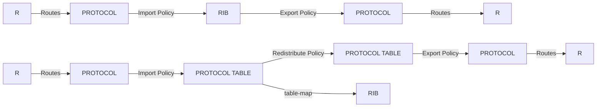

# 0. Something about this tutorial

:::note[编者的话]

作为世界上最大的网络设备公司，思科的路由器无疑是世界上最强大的路由器之一。然而，思科的文档尽管没有像某家公司一样需要合同才能阅览，但也十分的难查询，分布在不同的地方。新的 IOS-XR 虽然有了 xrdocs.io ，但是文档散乱的局面依然没有改变，同时思科相比 Juniper 其粗犷的配置模式也十分的难上手。幸运的是，有一位 JNCIE 在备考 CCIE 的过程中整理了 IOS-XR 的使用，并做成本文档。本文档力求将 IOS-XR 的操作对标到 JunOS 上，从而方便有 JunOS 背景的人进行学习。我们在获得授权后，将其整理到了 routing.wiki 上，供各位参考。

再次感谢这位 JNCIE 对这份文档的付出。

:::

本文档为简化版 IOS XR 入门速查手册，存在中英文混杂，看着不爽的请直接关闭

不保证完全无错误，若与思科官网文档有冲突请查询思科官网文档

因模拟实验中对面的设备是 MX，阅读本文档中的例子可能需要您能同时看懂 JUNOS 配置

本文档尽量避免使用私有协议，对于公有协议内有私有参数和私有非标行为进行特别标注

本文档将所有策略全部简化到规则链模式，不使用 XR 的高级策略嵌套功能，看着不爽请不要骂

版权没有 盗版不究

Author: JNCIE-SP#3211

Route Policy For JUNOS/IOS

正文内容详见详细文档
Index:

1. [Interface](./interface.mdx)

2. [Routing Policies, ACLs](./routing-policies-acl.mdx)

3. [Protocol Independent Routing and VRFs](./protocol-independent-routing-and-vrfs.mdx)

4. Device Infrastructure

5. IGP - RIP and OSPF

6. IGP - ISIS

7. BGP

8. MPLS

9. MPLS VPN

10. VPLS

11. EVPN MPLS and EVPN vxlan

12. IPv6

13. IPv6 routing protocols

14. Forwarding policy

15. QoS

16. Multicast
