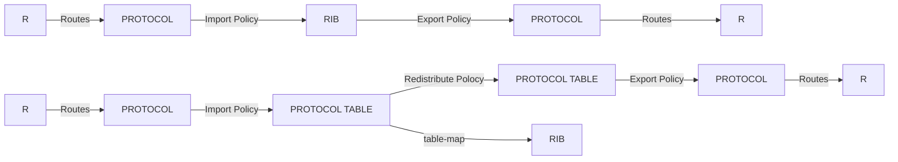
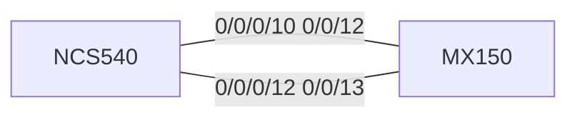
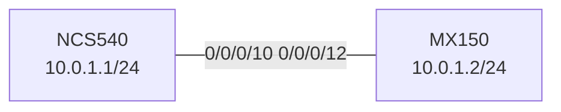

import Tabs from "@theme/Tabs";
import TabItem from "@theme/TabItem";

# 1.Interface

Route Policy For JUNOS/IOS



Test Topology



---

## 1. Interface name

接口命名规则

**物理接口**

例如：`GigabitEthernet 0/0/0/0`

接口命名规则为：`Type Rack / Slot/ Interface-card / Port`

Type:

```txt showLineNumbers=false
  FastEthernet Fa 100M
  GigabitEthernet Gi 1G
  TenGigE Te 10G
  TwentyFiveGigE TF 25G
  FortyGigE Fo 40G
  FiftyGigE Fi 50G
  HundredGigE Hu 100G
  TwoHundredGigE TH 200G
  FourHundredGigE FH 400G
  EightHundredGigE EH 800G
```

其他非以太网类型的接口参考思科文档

**loopback 接口**

例如：`loopback 0` 接口命名规则为`loopback ID` , 其中 ID 是一个整数，最小为 0

**链路聚合接口 bundle-ether**

例如：`bundle-ether 1` 接口命名规则为`bundle-ether ID` , 其中 ID 是一个整数，最小为 1

**隧道接口**

例如：`tunnel-ip 0` 接口命名规则为`tunnel-ip ID` , 其中 ID 是一个整数，最小为 0，包括 GRE 隧道，IPIP 隧道等接口

**子接口**

物理接口和聚合接口拥有子接口，子接口使用.区分 如 `GigabitEthernet 0/0/0/0.1`

**二层路由接口 BVI**

BVI 是 bridge-domain 的路由接口,例如 `BVI 5` ,接口命名规则为`BVI ID` , 其中 ID 是一个整数，最小为 1, 相当于 VLANIF 或 JUNOS 中的 IRB

**带外管理接口**

例如：` mgmtEth 0/RP0/CPU0/0` ,格式为 `mgmtEth location` ,使用问号查询，可配置 IP，是专用的管理口，连接到控制平面，不要让数据流量通过此接口,相当于 Juniper MX 的 fxp0

## 2. Interface config

### **物理接口**

例如

```cisco-iosxr
interface TenGigE0/0/0/10
 description "testdescr"
 mtu 9000
 ipv4 address 10.0.1.1 255.255.255.0
 ipv4 address 10.0.3.1 255.255.255.0 secondary
!
```

在接口下 可以配置物理层参数：协商模式`negotiation`/速率`speed`/双工模式`duplex`/MTU 等

可配置接口描述 descr

并可配置各地址类地址 如 IPv4/IPv6 等，地址可配置任意多个，但是只有一个是主地址，其他地址需要加 secondary

接口默认有 shutdown 参数，配置完成后需要 no shutdown，shutdown 下的接口会在配置内显示 shutdown

#### 验证



##### CONFIG

<Tabs defaultValue="NCS" values={[ { label: "NCS", value: "NCS" }, { label: "MX", value: "MX" }, ]} groupId="interface">
<TabItem value="NCS">

```cisco-iosxr
interface TenGigE0/0/0/10
 mtu 9000
 ipv4 address 10.0.1.1 255.255.255.0
 !
```

</TabItem>
<TabItem value="MX">
```junos
xe-0/0/12 {
    unit 0 {
        family inet {
            address 10.0.1.2/24;
        }
    }
}
```
</TabItem>
</Tabs>

##### OPERATION

<Tabs
defaultValue="NCS"
values={[
{ label: "NCS", value: "NCS" },
{ label: "MX", value: "MX" },
]}
groupId="interface">
<TabItem value="NCS">

```bash
RP/0/RP0/CPU0:NCS540(config)#do ping 10.0.1.2
Fri Apr 19 06:58:59.692 UTC
Type escape sequence to abort.
Sending 5, 100-byte ICMP Echos to 10.0.1.2 timeout is 2 seconds:
!!!!!
Success rate is 100 percent (5/5), round-trip min/avg/max = 1/1/1 ms
```

</TabItem>
  <TabItem value="MX">
```bash
[edit interfaces]
R1@MX150:R1# run ping 10.0.1.1
PING 10.0.1.1 (10.0.1.1): 56 data bytes
64 bytes from 10.0.1.1: icmp_seq=0 ttl=64 time=1.512 ms
64 bytes from 10.0.1.1: icmp_seq=1 ttl=64 time=1.586 ms
^C
--- 10.0.1.1 ping statistics ---
2 packets transmitted, 2 packets received, 0% packet loss
round-trip min/avg/max/stddev = 1.512/1.549/1.586/0.037 ms
```
</TabItem>
</Tabs>

### **子接口**

物理接口默认情况下，处理并转发无标记的以太网数据帧

子接口处理 802.1Q VLAN 标记的以太网数据帧，每个 VLAN 对应一个子接口

子接口配置如下

```cisco-iosxr
interface TenGigE0/0/0/10.20  # -----子接口
 ipv4 address 10.20.1.1 255.255.255.0
 encapsulation dot1q 20  #-----子接口vlan号
!
```

#### 验证

##### CONFIG

<Tabs defaultValue="NCS" values={[ { label: "NCS", value: "NCS" }, { label: "MX", value: "MX" }, ]} groupId="subinterface">
<TabItem value="NCS">

```cisco-iosxr
interface TenGigE0/0/0/10
 ipv4 address 10.0.1.1 255.255.255.0
!
interface TenGigE0/0/0/10.20
 ipv4 address 10.20.1.1 255.255.255.0
 encapsulation dot1q 20
!
interface TenGigE0/0/0/10.30
 ipv4 address 10.30.1.1 255.255.255.0
 encapsulation dot1q 30
!
```

</TabItem>
<TabItem value="MX">
```junos
[edit interfaces]
root@MX150# show
xe-0/0/12 {
    flexible-vlan-tagging;
    native-vlan-id 1;
    encapsulation flexible-ethernet-services;
    unit 0 {
        vlan-id 1;
        family inet {
            address 10.0.1.2/24;
        }
    }
    unit 20 {
        vlan-id 20;
        family inet {
            address 10.20.1.2/24;
        }
    }
    unit 30 {
        vlan-id 30;
        family inet {
            address 10.30.1.2/24;
        }
    }
}
```
</TabItem>
</Tabs>

##### OPERATION

<Tabs defaultValue="NCS" values={[ { label: "NCS", value: "NCS" }, { label: "MX", value: "MX" }, ]} groupId="subinterface">
<TabItem value="NCS">

```bash
RP/0/RP0/CPU0:NCS540(config)#do ping 10.0.1.2
Fri Apr 19 07:16:57.469 UTC
Type escape sequence to abort.
Sending 5, 100-byte ICMP Echos to 10.0.1.2 timeout is 2 seconds:
!!!!!
Success rate is 100 percent (5/5), round-trip min/avg/max = 1/1/1 ms
RP/0/RP0/CPU0:NCS540(config)#do ping 10.20.1.2
Fri Apr 19 07:17:00.270 UTC
Type escape sequence to abort.
Sending 5, 100-byte ICMP Echos to 10.20.1.2 timeout is 2 seconds:
!!!!!
Success rate is 100 percent (5/5), round-trip min/avg/max = 1/1/1 ms
RP/0/RP0/CPU0:NCS540(config)#do ping 10.30.1.2
Fri Apr 19 07:17:02.957 UTC
Type escape sequence to abort.
Sending 5, 100-byte ICMP Echos to 10.30.1.2 timeout is 2 seconds:
!!!!!
Success rate is 100 percent (5/5), round-trip min/avg/max = 1/1/1 ms
```

</TabItem>
<TabItem value="MX">
```bash
[edit]
root@MX150# run ping 10.0.1.1
PING 10.0.1.1 (10.0.1.1): 56 data bytes
64 bytes from 10.0.1.1: icmp_seq=0 ttl=255 time=1.739 ms
^C
--- 10.0.1.1 ping statistics ---
1 packets transmitted, 1 packets received, 0% packet loss
round-trip min/avg/max/stddev = 1.739/1.739/1.739/0.000 ms

[edit]
root@MX150# run ping 10.20.1.1
PING 10.20.1.1 (10.20.1.1): 56 data bytes
64 bytes from 10.20.1.1: icmp_seq=0 ttl=255 time=1.679 ms
^C
--- 10.20.1.1 ping statistics ---
1 packets transmitted, 1 packets received, 0% packet loss
round-trip min/avg/max/stddev = 1.679/1.679/1.679/0.000 ms

[edit]
root@MX150# run ping 10.30.1.1
PING 10.30.1.1 (10.30.1.1): 56 data bytes
64 bytes from 10.30.1.1: icmp_seq=0 ttl=255 time=1.579 ms
^C
--- 10.30.1.1 ping statistics ---
1 packets transmitted, 1 packets received, 0% packet loss
round-trip min/avg/max/stddev = 1.579/1.579/1.579/0.000 ms

````
</TabItem>
</Tabs>

### **隧道接口**

在隧道接口内您可以配置 GRE 或 IPIP 隧道，此处以 GRE 隧道为例，GRE 隧道相当于 JUNOS 中的 gr 接口 IPIP 隧道相当于 JUNOS 中的 ip 接口

GRE 隧道的配置例如

```cisco-iosxr
interface tunnel-ip1
 ipv4 address 33.33.33.1 255.255.255.0
 tunnel mode gre ipv4    #----隧道模式
 tunnel source 10.0.1.1  #----源地址
 tunnel destination 10.0.1.2 #----目标地址
 !
````

#### 验证

##### CONFIG

<Tabs defaultValue="NCS" values={[ { label: "NCS", value: "NCS" }, { label: "MX", value: "MX" }, ]} groupId="tunnel">
<TabItem value="NCS">
```cisco-iosxr
interface tunnel-ip1
 ipv4 address 33.33.33.1 255.255.255.0
 tunnel mode gre ipv4
 tunnel source 10.0.1.1
 tunnel destination 10.0.1.2
 !
```
</TabItem>
<TabItem value="MX">
```junos
 [edit interfaces]
R1@MX150:R1# show
gr-0/0/0 {
    unit 1 {
        tunnel {
            source 10.0.1.2;
            destination 10.0.1.1;
        }
        family inet {
            address 33.33.33.2/24;
        }
    }
}
xe-0/0/12 {
    unit 0 {
        family inet {
            address 10.0.1.2/24;
        }
    }
}
```
</TabItem>
</Tabs>
##### OPERATION
<Tabs defaultValue="NCS" values={[ { label: "NCS", value: "NCS" }, { label: "MX", value: "MX" }, ]} groupId="tunnel">
<TabItem value="NCS">
```bash
RP/0/RP0/CPU0:NCS540(config)#do ping 33.33.33.2
Fri Apr 19 09:23:41.054 UTC
Type escape sequence to abort.
Sending 5, 100-byte ICMP Echos to 33.33.33.2 timeout is 2 seconds:
!!!!!

Success rate is 100 percent (5/5), round-trip min/avg/max = 1/1/1 ms

````
</TabItem>
<TabItem value="MX">
```bash
R1@MX150:R1# run ping 33.33.33.1
PING 33.33.33.1 (33.33.33.1): 56 data bytes
64 bytes from 33.33.33.1: icmp_seq=0 ttl=64 time=1.577 ms
64 bytes from 33.33.33.1: icmp_seq=1 ttl=64 time=1.689 ms
64 bytes from 33.33.33.1: icmp_seq=2 ttl=64 time=1.640 ms
64 bytes from 33.33.33.1: icmp_seq=3 ttl=64 time=1.601 ms
64 bytes from 33.33.33.1: icmp_seq=4 ttl=64 time=1.733 ms
````

</TabItem>
</Tabs>

### **聚合接口**

可以配置聚合接口，配置如下

```cisco-iosxr
interface Bundle-Ether1
 ipv4 address 22.0.0.1 255.255.255.0
 lacp mode active #----聚合口LACP模式
!
interface TenGigE0/0/0/10
 bundle id 1 mode inherit  #----物理接口加入聚合口
!
interface TenGigE0/0/0/12
 bundle id 1 mode inherit  #----物理接口加入聚合口
!
```

其中 LACP 模式可以是 active 或 passive，将 LACP 模式设置为 on 将关闭 LACP，使用静态聚合

思科配置聚合组不需要提前定义最大聚合组数量

在 interface bundle-ether ID 下可使用 bundle 命令设置聚合参数，如 lacp 超时和最小活动链路数量等

```bash
RP/0/RP0/CPU0:NCS540(config)#int bundle-ether 1
RP/0/RP0/CPU0:NCS540(config-if)#bundle ?
  lacp-delay      Set the lacp-delay timeout for members of this bundle
  lacp-fallback   Set the lacp-fallback for members of this bundle
  load-balancing  Load balancing commands on a bundle
  logging         logging events for the members of this bundle
  maximum-active  Set a limit on the number of links that can be active
  minimum-active  Set the minimum criteria for the bundle to be active
  shutdown        Bring all links in the bundle down to Standby state
  wait-while      Set the wait-while timeout for members of this bundle
```

#### 验证

##### CONFIG

<Tabs defaultValue="NCS" values={[ { label: "NCS", value: "NCS" }, { label: "MX", value: "MX" }, ]} groupId="bundle">
<TabItem value="NCS">
```
interface Bundle-Ether1
 ipv4 address 22.0.0.1 255.255.255.0
 lacp mode active
!
interface TenGigE0/0/0/10
 bundle id 1 mode inherit
!
interface TenGigE0/0/0/12
 bundle id 1 mode inherit
!
```
</TabItem>
<TabItem value="MX">
```junos
[edit interfaces]
root@MX150# show
xe-0/0/12 {
    gigether-options {
        802.3ad ae0;
    }
}
xe-0/0/13 {
    gigether-options {
        802.3ad ae0;
    }
}
ae0 {
    aggregated-ether-options {
        lacp {
            active;
        }
    }
    unit 0 {
        family inet {
            address 22.0.0.2/24;
        }
    }
}
```
</TabItem>
</Tabs>

##### OPERATION

<Tabs defaultValue="NCS" values={[ { label: "NCS", value: "NCS" }, { label: "MX", value: "MX" }, ]} groupId="bundle">
<TabItem value="NCS">

```bash
RP/0/RP0/CPU0:NCS540(config)#do ping  22.0.0.2
Fri Apr 19 09:47:15.459 UTC
Type escape sequence to abort.
Sending 5, 100-byte ICMP Echos to 22.0.0.2 timeout is 2 seconds:
!!!!!
Success rate is 100 percent (5/5), round-trip min/avg/max = 1/5/23 ms
```

</TabItem>
<TabItem value="MX">

```bash
root@MX150# run ping 22.0.0.1
PING 22.0.0.1 (22.0.0.1): 56 data bytes
64 bytes from 22.0.0.1: icmp_seq=0 ttl=64 time=1.620 ms
64 bytes from 22.0.0.1: icmp_seq=1 ttl=64 time=1.556 ms
^C
--- 22.0.0.1 ping statistics ---
2 packets transmitted, 2 packets received, 0% packet loss
round-trip min/avg/max/stddev = 1.556/1.588/1.620/0.032 ms
```

</TabItem>
</Tabs>

## 3.Layer 2 service and related interfaces

您可以在 IOS XR 上配置二层交换和对应的接口，此操作通过 l2vpn 的 bridge-domain 完成，使用 BVI 接口进行路由

在 XR 中，bridge domain 需要建立在 bridge group 下，一个 bridge group 下可以建立任意数量的 bridge domain，可以都建在一个 group 下也可以分开

此处为 Trunk 口和 Access 口，建立 bridge-domain 及路由接口 BVI 的示例

```cisco-iosxr
interface TenGigE0/0/0/10.20 l2transport   #----vlan子接口启用二层
 encapsulation dot1q 20                    #----vlan id
 rewrite ingress tag pop 1 symmetric       #----进桥时拆vlan头，出桥时打回来对称（必须加）
！
interface TenGigE0/0/0/12       #----物理接口，untag
 l2transport                    #----启用二层
 !
!

interface BVI20  #----三层接口
 ipv4 address 20.0.0.1 255.255.255.0
!

l2vpn
 bridge group sw
  bridge-domain 20  #----建立Bridge-domain
   interface TenGigE0/0/0/12 #----加入untag的物理接口
   !
   interface TenGigE0/0/0/10.20 #----加入tag的vlan子接口
   !
   routed interface BVI20  #----加入三层接口
   !
  !
 !
!
```

### 验证

#### CONFIG

<Tabs defaultValue="NCS" values={[ { label: "NCS", value: "NCS" }, { label: "MX", value: "MX" }, ]} groupId="l2vpn">
<TabItem value="NCS">

```cisco-iosxr
interface TenGigE0/0/0/10.20 l2transport
 encapsulation dot1q 20
 rewrite ingress tag pop 1 symmetric
！
interface TenGigE0/0/0/12
 l2transport
 !
!

interface BVI20
 ipv4 address 20.0.0.1 255.255.255.0
!

l2vpn
 bridge group sw
  bridge-domain 20
   interface TenGigE0/0/0/12
   !
   interface TenGigE0/0/0/10.20
   !
   routed interface BVI20
   !
  !
 !
!
```

</TabItem>
<TabItem value="MX">

```junos
[edit]
root@MX150# show
logical-systems {
    R1 {
        interfaces {
            xe-0/0/12 {
                unit 20 {
                    vlan-id 20;
                    family inet {
                        address 20.0.0.2/24;
                    }
                }
            }
        }
    }
    R2 {
        interfaces {
            xe-0/0/13 {
                unit 0 {
                    family inet {
                        address 20.0.0.3/24;
                    }
                }
            }
        }
    }
}
interfaces {
    xe-0/0/12 {
        vlan-tagging;
    }
}
}
```

</TabItem>
</Tabs>

#### OPERATION

<Tabs defaultValue="NCS" values={[ { label: "NCS", value: "NCS" }, { label: "MX", value: "MX" }, ]} groupId="l2vpn">
<TabItem value="NCS">

```bash
RP/0/RP0/CPU0:NCS540(config)#do ping 20.0.0.2
Fri Apr 19 11:38:36.336 UTC
Type escape sequence to abort.
Sending 5, 100-byte ICMP Echos to 20.0.0.2 timeout is 2 seconds:
!!!!!
Success rate is 100 percent (5/5), round-trip min/avg/max = 1/1/1 ms
RP/0/RP0/CPU0:NCS540(config)#do ping 20.0.0.3
Fri Apr 19 11:38:38.014 UTC
Type escape sequence to abort.
Sending 5, 100-byte ICMP Echos to 20.0.0.3 timeout is 2 seconds:
!!!!!
Success rate is 100 percent (5/5), round-trip min/avg/max = 1/5/24 ms
```

</TabItem>
<TabItem value="MX">

```bash
[edit]
R1@MX150:R1# run ping 20.0.0.1
PING 20.0.0.1 (20.0.0.1): 56 data bytes
64 bytes from 20.0.0.1: icmp_seq=0 ttl=255 time=1.513 ms
^C
--- 20.0.0.1 ping statistics ---
1 packets transmitted, 1 packets received, 0% packet loss
round-trip min/avg/max/stddev = 1.513/1.513/1.513/0.000 ms

[edit]
R1@MX150:R1# run ping 20.0.0.3
PING 20.0.0.3 (20.0.0.3): 56 data bytes
64 bytes from 20.0.0.3: icmp_seq=0 ttl=64 time=0.497 ms
64 bytes from 20.0.0.3: icmp_seq=1 ttl=64 time=0.546 ms
^C
--- 20.0.0.3 ping statistics ---
2 packets transmitted, 2 packets received, 0% packet loss
round-trip min/avg/max/stddev = 0.497/0.522/0.546/0.024 ms

[edit]
R2@MX150:R2# run ping 20.0.0.1
PING 20.0.0.1 (20.0.0.1): 56 data bytes
64 bytes from 20.0.0.1: icmp_seq=0 ttl=255 time=1.539 ms
^C
--- 20.0.0.1 ping statistics ---
1 packets transmitted, 1 packets received, 0% packet loss
round-trip min/avg/max/stddev = 1.539/1.539/1.539/0.000 ms

[edit]
R2@MX150:R2# run ping 20.0.0.2
PING 20.0.0.2 (20.0.0.2): 56 data bytes
64 bytes from 20.0.0.2: icmp_seq=0 ttl=64 time=0.487 ms
^C
--- 20.0.0.2 ping statistics ---
1 packets transmitted, 1 packets received, 0% packet loss
round-trip min/avg/max/stddev = 0.487/0.487/0.487/0.000 ms

```
</TabItem>
</Tabs>

二层监测命令：

`show l2vpn bridge-domain` 查询 bridge domain 状态，后面可跟过滤参数 `group NAME`或 `bd-name NAME`

```bash
RP/0/RP0/CPU0:NCS540#show l2vpn bridge-domain bd-name 20
Fri Apr 19 11:40:02.931 UTC
Legend: pp = Partially Programmed.
Bridge group: sw, bridge-domain: 20, id: 1, state: up, ShgId: 0, MSTi: 0
  Aging: 300 s, MAC limit: 64000, Action: none, Notification: syslog
  Filter MAC addresses: 0
  ACs: 3 (3 up), VFIs: 0, PWs: 0 (0 up), PBBs: 0 (0 up), VNIs: 0 (0 up)
  List of ACs:
    BV20, state: up, BVI MAC addresses: 1
    Te0/0/0/10.20, state: up, Static MAC addresses: 0
    Te0/0/0/12, state: up, Static MAC addresses: 0
  List of Access PWs:
  List of VFIs:
  List of Access VFIs:
```

```bash startLineNumber=4 showLineNumbers=false
Bridge group: sw, bridge-domain: 20, id: 1, state: up, ShgId: 0, MSTi: 0
```

其中此行的 ID，为 bridge id,此处为 1（从 0 开始自动分配，下面查询 mac 表时需要用到）

`show l2vpn mac-learning mac topo-id ID location 0/0/CPU0 `查询 mac learning 表，

此处`topo-id ID`也可为`all` 查询全部 bridge-domain 的 mac learning

```bash
RP/0/RP0/CPU0:NCS540#show l2vpn mac-learning mac topo-id 1 location 0/0/CPU0
Fri Apr 19 11:53:34.577 UTC
Topo ID    Producer       Next Hop(s)       Mac Address       IP Address
---------- -------------- ----------------- ----------------- ---------------
1          0/0/CPU0       Te0/0/0/10.20     ec13.dbd4.400c
1          0/0/CPU0       Te0/0/0/12        ec13.dbd4.400d
```

## 4.Interface status check and monitor

### **查看接口状态**

```bash
RP/0/RP0/CPU0:NCS540#show interfaces brief
Fri Apr 19 11:59:36.832 UTC

               Intf       Intf        LineP              Encap  MTU        BW
               Name       State       State               Type (byte)    (Kbps)
--------------------------------------------------------------------------------
                BV5          up          up               ARPA  1514   10000000
               BV20          up          up               ARPA  1514   10000000
                Nu0          up          up               Null  1500          0
          Gi0/0/0/0          up          up               ARPA  1514    1000000
        Gi0/0/0/0.5          up          up             802.1Q  1518    1000000
         Gi0/0/0/16        down        down               ARPA  1514    1000000
          Te0/0/0/1  admin-down  admin-down               ARPA  1514   10000000
          Te0/0/0/2  admin-down  admin-down               ARPA  1514   10000000
          Te0/0/0/3  admin-down  admin-down               ARPA  1514   10000000
          Te0/0/0/4  admin-down  admin-down               ARPA  1514   10000000
          Te0/0/0/5  admin-down  admin-down               ARPA  1514   10000000
          Te0/0/0/6  admin-down  admin-down               ARPA  1514   10000000
          Te0/0/0/7  admin-down  admin-down               ARPA  1514   10000000
          Te0/0/0/8  admin-down  admin-down               ARPA  1514   10000000
          Te0/0/0/9  admin-down  admin-down               ARPA  1514   10000000
         Te0/0/0/10          up          up               ARPA  1514   10000000
      Te0/0/0/10.20          up          up             802.1Q  1518   10000000
         Te0/0/0/11  admin-down  admin-down               ARPA  1514   10000000
         Te0/0/0/12          up          up               ARPA  1514   10000000
         Te0/0/0/13  admin-down  admin-down               ARPA  1514   10000000
```

### **查看接口描述**

```bash
RP/0/RP0/CPU0:NCS540#show interfaces description
Fri Apr 19 12:00:13.286 UTC

Interface          Status      Protocol    Description
--------------------------------------------------------------------------------
BV5                up          up
BV20               up          up
Nu0                up          up
Gi0/0/0/0          up          up          "to mgmt net"
Gi0/0/0/0.5        up          up
Gi0/0/0/16         down        down
Te0/0/0/1          admin-down  admin-down
```

### **查看接口信息**

```bash
RP/0/RP0/CPU0:NCS540#show interfaces tenGigE 0/0/0/10
Fri Apr 19 12:01:32.326 UTC
TenGigE0/0/0/10 is up, line protocol is up
  Interface state transitions: 3
  Hardware is TenGigE, address is d46a.35be.8028 (bia d46a.35be.8028)
  Internet address is Unknown
  MTU 1514 bytes, BW 10000000 Kbit (Max: 10000000 Kbit)
     reliability 255/255, txload 0/255, rxload 0/255
  Encapsulation ARPA,
  Full-duplex, 10000Mb/s, 10GBASE-LR, link type is force-up
  output flow control is off, input flow control is off
  loopback not set,
  Last link flapped 06:16:57
  Last input 00:00:00, output 00:00:00
  Last clearing of "show interface" counters never
  5 minute input rate 0 bits/sec, 0 packets/sec
  5 minute output rate 0 bits/sec, 0 packets/sec
     24220 packets input, 3783645 bytes, 0 total input drops
     1 drops for unrecognized upper-level protocol
     Received 168 broadcast packets, 23623 multicast packets
              0 runts, 0 giants, 0 throttles, 0 parity
     0 input errors, 0 CRC, 0 frame, 0 overrun, 0 ignored, 0 abort
     23468 packets output, 2784150 bytes, 0 total output drops
     Output 9 broadcast packets, 22880 multicast packets
     0 output errors, 0 underruns, 0 applique, 0 resets
     0 output buffer failures, 0 output buffers swapped out
     3 carrier transitions
```

注意：三层接口还能看到 IP

### **查看接口详细信息**

```bash
RP/0/RP0/CPU0:NCS540#show interfaces tenGigE 0/0/0/10 detail
Fri Apr 19 12:03:20.084 UTC
TenGigE0/0/0/10 is up, line protocol is up
  Interface state transitions: 3
  Hardware is TenGigE, address is d46a.35be.8028 (bia d46a.35be.8028)
  Internet address is Unknown
  MTU 1514 bytes, BW 10000000 Kbit (Max: 10000000 Kbit)
     reliability 255/255, txload 0/255, rxload 0/255
  Encapsulation ARPA,
  Full-duplex, 10000Mb/s, 10GBASE-LR, link type is force-up
  output flow control is off, input flow control is off
  loopback not set,
  Last link flapped 06:18:45
  Last input 00:00:18, output 00:00:18
  Last clearing of "show interface" counters never
  5 minute input rate 0 bits/sec, 0 packets/sec
  5 minute output rate 0 bits/sec, 0 packets/sec
     24225 packets input, 3784933 bytes, 0 total input drops
     1 drops for unrecognized upper-level protocol
     Received 168 broadcast packets, 23627 multicast packets
              0 runts, 0 giants, 0 throttles, 0 parity
     0 input errors, 0 CRC, 0 frame, 0 overrun, 0 ignored, 0 abort
     23472 packets output, 2784470 bytes, 0 total output drops
     Output 10 broadcast packets, 22883 multicast packets
     0 output errors, 0 underruns, 0 applique, 0 resets
     0 output buffer failures, 0 output buffers swapped out
     3 carrier transitions
```

### **查看接口分类型统计**

```bash
RP/0/RP0/CPU0:NCS540#show interfaces tenGigE 0/0/0/10  accounting
Fri Apr 19 12:05:35.752 UTC
TenGigE0/0/0/10
  Protocol              Pkts In         Chars In     Pkts Out        Chars Out
  IPV4_UNICAST              360            40078            0                0
  ARP                       139             8340          151             6398
```

### **查看接口摘要**

```bash
RP/0/RP0/CPU0:NCS540#show interfaces tenGigE 0/0/0/10 sparse
Fri Apr 19 12:07:14.870 UTC

 Interface name :               TenGigE0/0/0/10
 Operational state :            up
 Admin state :                  up
 MAC address :                  d4:6a:35:be:80:28
 Burned In Address :            d46a.35be.8028
 Max. Bandwidth (Kbit) :        10000000
 Effective Bandwidth (Kbit) :   10000000
 MTU (in bytes) :               1514
 Duplexity :                    Full-duplex
 Link type :                    force-up
```

### **接口状态变化时间**

```bash
RP/0/RP0/CPU0:NCS540#show interfaces tenGigE 0/0/0/10 | include flap
Fri Apr 19 12:08:53.132 UTC
  Last link flapped 06:24:18
```

FLAP 时间为最后一次状态改变距离现在的时间

### **接口实时流量监测**

```bash
RP/0/RP0/CPU0:NCS540#monitor interface
Fri Apr 19 12:10:21.898 UTC
NCS540               Monitor Time: 00:00:06          SysUptime: 48:18:10

Protocol:General
Interface             In(bps)      Out(bps)     InBytes/Delta  OutBytes/Delta
BV20                 (statistics not available)
BV5                  (statistics not available)
Gi0/0/0/0.5          (statistics not available)
Gi0/0/0/0              1000/  0%     1000/  0%     2.1M/128        2.5M/2890
Gi0/0/0/16                0/  0%        0/  0%        0/0             0/0
Hu0/0/1/0                 0/  0%        0/  0%        0/0             0/0
Hu0/0/1/1                 0/  0%        0/  0%        0/0             0/0
Mg0/RP0/CPU0/0            0/  0%        0/  0%        0/0             0/0
Te0/0/0/1                 0/  0%        0/  0%        0/0             0/0
Te0/0/0/10.20        (statistics not available)
Te0/0/0/10                0/  0%        0/  0%     3.7M/0          2.7M/84
Te0/0/0/11                0/  0%        0/  0%        0/0             0/0
Te0/0/0/12                0/  0%        0/  0%     2.8M/0          1.5M/84
Te0/0/0/13                0/  0%        0/  0%        0/0             0/0


RP/0/RP0/CPU0:NCS540#monitor interface tenGigE 0/0/0/10
Fri Apr 19 12:11:14.839 UTC
NCS540               Monitor Time: 00:00:14          SysUptime: 48:19:11


TenGigE0/0/0/10 is up, line protocol is up
Encapsulation ARPA

Traffic Stats:(2 second rates)                                     Delta
  Input  Packets:                     24244                            0
  Input  pps:                             0
  Input  Bytes:                     3790505                            0
  Input  Kbps (rate):                     0                       (  0%)
  Output Packets:                     23490                            1
  Output pps:                             0
  Output Bytes:                     2785962                           84
  Output Kbps (rate):                     0                       (  0%)

Errors Stats:
  Input  Total:                           0                            0
  Input  CRC:                             0                            0
  Input  Frame:                           0                            0
  Input  Overrun:                         0                            0
  Output Total:                           0                            0
  Output Underrun:                        0                            0

```

### **查看光模块状态**

```bash
RP/0/RP0/CPU0:NCS540#show controllers optics 0/0/0/10
Fri Apr 19 12:13:12.826 UTC

 Controller State: Up

 Transport Admin State: In Service

 Laser State: On

 LED State: Green

 Optics Status

         Optics Type:  SFP+ 10G LR
         Wavelength = 1310.00 nm

         Alarm Status:
         -------------
         Detected Alarms: None


         LOS/LOL/Fault Status:

         Laser Bias Current = 40.8 mA
         Actual TX Power = -1.36 dBm
         RX Power = -2.04 dBm

         Performance Monitoring: Disable

         THRESHOLD VALUES
         ----------------

         Parameter                 High Alarm  Low Alarm  High Warning  Low Warning
         ------------------------  ----------  ---------  ------------  -----------
         Rx Power Threshold(dBm)          1.4      -21.0           0.4        -18.9
         Tx Power Threshold(dBm)          0.4       -8.4           0.0         -7.3
         LBC Threshold(mA)              85.00       7.00         80.00        12.00
         Temp. Threshold(celsius)      105.00     -45.00         85.00       -40.00
         Voltage Threshold(volt)         3.63       2.97          3.46         3.13

         Polarization parameters not supported by optics

         Temperature = 29.00 Celsius
         Voltage = 3.29 V

 Transceiver Vendor Details

         Form Factor            : SFP+
         Optics type            : SFP+ 10G LR
         Name                   : FINISAR
         OUI Number             : 00.90.65
         Part Number            : FTLX1471D3BCL
         Rev Number             : A
         Serial Number          : AVE0V5Y
         PID                    : FTLX1471D3BCL
         VID                    : A
         Date Code(yy/mm/dd)    : 17/05/22
```

这里不区分接口类型，只区分接口号，在 controller 下

## 5. Interface hardware config

配置`controller optics INTNAME` 可以手动设置光模块识别速度，和 breakout 等

```bash
RP/0/RP0/CPU0:NCS540(config)#controller optics 0/0/0/20
RP/0/RP0/CPU0:NCS540(config-Optics)#speed ?
  WORD  1g | 10g | 25g | 40g | 50g | 100g | 200g | 400g | none
        4x10 | 4x25 | 2x50 | 8x50 | 4x100 | 3x100 | 2x100 | 1x100
RP/0/RP0/CPU0:NCS540(config-Optics)#speed 1g
```

对于 NCS540 等设备上的 25G 端口，调整其速度为每四个一组，作为一个 quad 从 0 开始

以下是将其前四个口和后四个口 25G 接口设置为 10G 的示例

```bash
hw-module quad 0 location 0/0/CPU0 instance 0
 mode 10g
!
hw-module quad 1 location 0/0/CPU0 instance 0
 mode 10g
!
```

## 6. Interface based speed limit

GOTO file Section 3 file ACLs and Section 16 for QoS
[Routing policies, ACLs](./routing-policies-acl.mdx#4acl)
