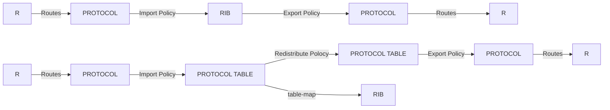
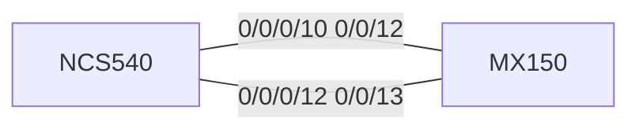
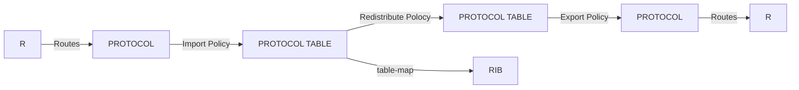
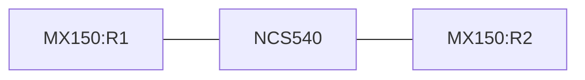

# 2. Routing policies, ACLs

Route Policy For JUNOS/IOS



Test Topology



---

## 1. Routing Policies

### 路由策略的用途

一般用于以下情况（但不仅限于此）

- 不需要把所有收到的路由都导入路由表
- 不需要把所有收到的路由发给邻居
- 需要或者不需要把特定路由重分发至特定路由协议
- 修改路由相关属性

### 路由策略的类型

- Import policy （控制收到的路由进对应的 Protocol table）
- Export policy （控制 Protocol table 的路由是否发送）
- Redistribute policy （控制协议间重分发）
- Propagate policy (ISIS level1 和 level2 之间重分发)
- BGP table-map policy（控制 BGP 表进 RIB）

IOS XR 上，路由策略如图



### 路由策略的结构

路由策略使用 RPL 语法， 匹配，然后执行操作

IOS XR 下，RPL 可实现嵌套等高级功能，在本文档内，只讨论链式规则的写法，更复杂的规则请参考思科文档。

把路由策略写的特别复杂将导致不可维护的规则产生，请确保几个月后还能看得懂你之前写的策略、

### 基本语法

在 IOS XR 中，路由策略的基本写法如下

```cisco-iosxr
route-filter xxx
  if (match condition 1) then
     route attr change 1
     done/drop/pass
  endif
  if (match condition 2) then
     route attr change 2
     done/drop/pass
  endif
  done/drop/pass
  end
```

其等效于 JUNOS 中的

```junos
policy-statement xxxx {
    term 1 {
       from {
       match conditon 1
       }
       then {
       route attr change 1
       accept/reject/next term
       }
       term 2 {
       from {
       match conditon 2
       }
       then {
       route attr change 2
       accept/reject/next term
       }
       then accept/reject/next term
}
```

### 支持的匹配条件

对于不同的策略应用位置，存在共同的匹配条件和不同的匹配条件

常见的共同匹配条件例如：

- prefix 和 prefix list
- next hop 地址

常见的非共同匹配条件如：

- community (BGP 的 import 和 export）
- as-path（BGP 的 import 和 export）
- ospf-area（OSPF 的 import 和 export）

对于 redistribute policy，匹配条件同来源协议，路由属性修改条件同目标协议

#### 匹配条件举例

| IOS-XR                                     | JunOS                                                                                        | 备注                                          |
| ------------------------------------------ | -------------------------------------------------------------------------------------------- | --------------------------------------------- |
| `destination in (28.0.0.0/24 ge 24 le 32)` | `route-filter 28.0.0.0/24 orlonger` / `route-filter 28.0.0.0/24 prefix-length-range /24-/32` |                                               |
| `destination in (28.0.0.0/24)`             | `route-filter 28.0.0.0/24 exact`                                                             |                                               |
| `destination in (11.0.0.0/24,28.0.0.0/24)` | `route-filter 28.0.0.0/24 exact + route-filter 11.0.0.0/24 exact`                            | JunOS 对应的是在同一个 term 中，此时体现为 OR |
| `destination in prefix-set example`        | `route-filter-list example`                                                                  |                                               |
| `tag in 1000`                              | `tag 1000`                                                                                   |                                               |
| `local-preference is 100`                  | `local-preference 100`                                                                       |                                               |
| `community in communityexample1`           | `community communityexample1`                                                                |                                               |
| `as-path in aspathexample1`                | `as-path aspathexample1`                                                                     |                                               |
| `apply example-policy`                     | `policy example-policy`                                                                      | 策略允许嵌套，允许调用另一个策略用于匹配      |

多个匹配条件可以使用逻辑关系连接

如

```cisco-iosxr
 destination in ( 28.0.0.0/24 , 11.0.0.0/24 ) and community in example1 and community in example2
```

等价于 junos 中的

```junos
from {
  route-filter 28.0.0.0/24 exact
  route-filter 11.0.0.0/24 exact
  community example1
  community example2
}

```

#### prefix-set

等同于 JUNOS 中的`route-filter-list`

配置例如

```cisco-iosxr
prefix-set LANIP
10.0.0.0/8 ge 8,
172.16.0.0/12 ge 12,
192.168.0.0/16 ge 16
end-set
```

等同于

```junos
route-filter-list LANIP {
    192.168.0.0/16 orlonger;
    172.16.0.0/12 orlonger;
    192.168.0.0/16 orlonger;
}
```

参考上述匹配条件中的 destination

#### community-set 和 as-path

##### community define in community-set

```cisco-iosxr
community-set test
 888:1001
 888:1002
end-set
```

等效于 JUNOS

```junos
community test members [ 888:1001 888:1002 ];
```

##### AS-PATH config in as-path-set

```cisco-iosxr
as-path-set CUST1
    ios-regex '_12345_',
    ios-regex '_12345$',
    ios-regex '_12367$'
end-set
```

等效于 JUNOS

```junos
 as-path-group CUST1 {
as-path 1 ".* 12345 .*";
as-path 2 ".* 2345";
as-path 3 ".* 12367";
}
```

### IOS 和 JUNOS 的 as-path regex 区别

| 功能                                                           | IOS-XR                   | JunOS                                 |
| -------------------------------------------------------------- | ------------------------ | ------------------------------------- |
| Match anything                                                 | `.*`                     | `.*`                                  |
| Match at least one character                                   | `.+`                     | `.+`                                  |
| Match routes local to this AS                                  | `^$`                     | `()`                                  |
| Match routes originated by AS1800                              | `_1800$`                 | `.* 1800`                             |
| Match routes received from AS1800                              | `^1800_`                 | `1800 .*`                             |
| Match routes via AS1800                                        | `_1800_`                 | `.* 1800 .*`                          |
| Match routes via AS1800 and then AS790                         | `_790_1800_`             | `.* 790 1800 .*`                      |
| Multiple AS1800 in sequence (used to match AS-PATH prepends)   | `(1800_)+`               | `.* 1800+ .*`                         |
| Match routes via AS65530 inside a BGP Confederation            | `\(65530\)`              | `.* 65530 .*` no way to match the “(“ |
| Match AS_PATH length of one                                    | `^[0-9]+$`               | `.`                                   |
| Match AS_PATH length of two                                    | `^[0-9]+_[0-9]+$`        | `. .`                                 |
| Match AS_PATH length of one or two                             | `^[0-9]*_[0-9]+$`        | `.? .`                                |
| Match AS_PATH length of one or two (will also match zero)      | `^[0-9]*_[0-9]*$`        | `.? .?`                               |
| Match AS_PATH length of three                                  | `^[0-9]+_[0-9]+_[0-9]+$` | `. . .`                               |
| Match anything which has gone through either AS701 or AS1800   | `_(701\|1800)_`          | `.* (701\|1800) .*`                   |
| Match anything of origin AS12163 and has passed through AS1849 | `_1849(_.+_)12163$`      | `.* 1849 .* 12163`                    |

### 处理操作

- Terminate actions

  - done (=accept)
  - drop (=reject)

- Control action
  - pass（accept, and continue to next, can be override)
- Modify route attribute action
  - set (local-pref/med/metric/community/tag)
  - delete (community)
  - prepend (as-path)
  - remove (as-path private-as)

如：

```cisco-iosxr
set xxxxx (set route attr such as local-pref/med/metric )
delete community all / delete community in example1 / delete community not in example1 (delete community)
remove as-path private-as entire-aspath (remove private as)
prepend as-path 888 3 (prepend as-patth with as888 3 times)
```

等

### 策略应用样例

此处以重分发 OSPF 路由进 EBGP 为例

To export OSPF routes to specific BGP neighbor but not all you need to use 2 step.

Step 1: redistribute OSPF to BGP router with a policy to add community to show where it from.

```cisco-iosxr
community-set fromospf
  888:1001
end-set


route-policy ospf-redist
  set community fromospf additive
  done
end-policy


router bgp 888

 address-family ipv4 unicast
  <omit>
  redistribute ospf 0 route-policy ospf-redist

```

Step 2: add bgp export policy to neighbor, filtering community, and remove if it is required.

```cisco-iosxr
route-policy bgp-e
  if community in fromospf then
    delete community in fromospf
    done
  endif
  drop
end-policy

router bgp 888
<omit>
 !
 neighbor 10.0.2.2
  <omit>
  address-family ipv4 unicast
   route-policy bgp-e out
  !
 !
!
```

:::info

**In IOS XR, BGP table have no tag options!**

**And IGP table have no community options!**

Use community when redistribute to BGP

Use tag when redistribute to IGP

:::

**修改已有的路由策略**

在操作模式下 edit route-policy NAME 会打开文本编辑器，可以进行修改，实时生效

在配置模式下可以重新配置 route policy NAME，会完全覆盖内容，commit 后生效

## 2. Protocol default import/export behavior

在 IOS XR 下，在无 redistribute 操作的情况下，各协议只能看到自己的路由

redistribute 操作的默认策略是 accept all
**但是 IBGP 不会被 redistribute 进入 IGP, 要重分发 IBGP 路由,使用以下配置**

```cisco-iosxr
router bgp ID
bgp redistribute-internal
```

### 各协议默认操作

| 协议 | 默认 import | 默认 export                   | 备注                                                                                                         |
| ---- | ----------- | ----------------------------- | ------------------------------------------------------------------------------------------------------------ |
| RIP  | all         | all from rip                  | 在设置 default-metric 之前将不会发送任何 redistribute 的路由                                                 |
| OSPF | all         | all from ospf + redistributed |                                                                                                              |
| IBGP | all         | all from bgp + redistributed  |                                                                                                              |
| EBGP | none        | none                          |                                                                                                              |
| ISIS | all         | all from isis + redistributed | 注意 ISIS 存在两个 LEVEL,需要在 redistribute 时选择 level 或使用 propagate 在两个 level 之间互相导入导出路由 |

验证过程略，验证思路为 R1---XR---R2，建立同类型会话/建立 BGP+IGP 互相 redistribute，观察在 R1 和 R2 上收到的路由

### 路由 export 基本操作

（跨协议需要）[(BGP/ISIS 需要) `address-family ipv4 unicast` ]（改成需要的地址类）

（跨协议需要）`redistribute 来源协议 来源协议 id [ route-filter NAME ]`

OSPF/ISIS 自动导出

BGP 需要

```cisco-iosxr
neighbor NEIGHBORIP
address-family ipv4 unicast route-policy NAME out
```

RIP 需要

```cisco-iosxr
interface INTFNAME
route-policy NAME out
```

#### redistribute 位置

##### RIP

```cisco-iosxr
router rip
   redistribute xxxxx
```

##### ISIS

```cisco-iosxr
router isis ID
   address-family AFI SAFI
   redistribute xxxxxxxx
```

##### OSPF

```cisco-iosxr
router ospf ID
   redistribute xxxxx
```

##### BGP

```cisco-iosxr
router bgp ID
   address-family AFI SAFI
   redistribute xxxxxxxx
```

#### import/export 位置

##### BGP

```cisco-iosxr
router bgp ID
  neighbor NEIGHBORIP
     address-family AFI SAFI
        route-policy NAME in
        route-policy NAME out
```

##### RIP

```cisco-iosxr
router rip
  interface IFNAME
    route-policy NAME in
    route-policy NAME out
```

### 路由策略的验证

可以通过查看导入导出的路由和重分发的路由来验证路由策略

### 协议路由表操作

#### BGP

Received route, 同 JUNOS 上的`show route receive-protocol bgp NEIGHBORIP  `

```bash
RP/0/RP0/CPU0:NCS540(config)#do show bgp neighbor 10.220.23.1 routes
Sun Apr 21 14:37:45.840 UTC
BGP router identifier 10.220.23.0, local AS number 888
BGP generic scan interval 60 secs
Non-stop routing is enabled
BGP table state: Active
Table ID: 0xe0000000   RD version: 24
BGP main routing table version 24
BGP NSR Initial initsync version 1 (Reached)
BGP NSR/ISSU Sync-Group versions 0/0
BGP scan interval 60 secs

Status codes: s suppressed, d damped, h history, * valid, > best
              i - internal, r RIB-failure, S stale, N Nexthop-discard
Origin codes: i - IGP, e - EGP, ? - incomplete
   Network            Next Hop            Metric LocPrf Weight Path
*>i11.2.0.0/16        10.220.23.1                   100      0 i
*>i11.2.2.2/32        10.220.23.1                   100      0 i

```

Advertised route,同 JUNOS 上的`show route advertising-protocol bgp NEIGHBORIP  `

```bash
RP/0/RP0/CPU0:NCS540(config)#do show bgp advertised neighbor 10.220.23.1 summary
Sun Apr 21 14:45:52.017 UTC
Network            Next Hop        From            AS Path
10.220.12.0/31     10.220.23.0     Local           ?
11.1.0.0/16        10.220.12.1     Local           ?
11.1.1.1/32        10.220.12.1     Local           ?

```

Route in BGP table， include BGP routes and redistributed routes

```bash
RP/0/RP0/CPU0:NCS540(config)#do show bgp  ipv4 unicast
Sun Apr 21 14:52:26.340 UTC
BGP router identifier 10.220.23.0, local AS number 888
BGP generic scan interval 60 secs
Non-stop routing is enabled
BGP table state: Active
Table ID: 0xe0000000   RD version: 30
BGP main routing table version 30
BGP NSR Initial initsync version 1 (Reached)
BGP NSR/ISSU Sync-Group versions 0/0
BGP scan interval 60 secs

Status codes: s suppressed, d damped, h history, * valid, > best
              i - internal, r RIB-failure, S stale, N Nexthop-discard
Origin codes: i - IGP, e - EGP, ? - incomplete
   Network            Next Hop            Metric LocPrf Weight Path
*> 10.220.12.0/31     0.0.0.0                  0         32768 ?
*> 11.1.0.0/16        10.220.12.1              0         32768 ?
*> 11.1.1.1/32        10.220.12.1              1         32768 ?
*>i11.2.0.0/16        10.220.23.1                   100      0 i
*>i11.2.2.2/32        10.220.23.1                   100      0 i

Processed 5 prefixes, 5 paths
```

#### RIP

表内路由（无法匹配什么被发出去了）

```bash
RP/0/RP0/CPU0:NCS540(config)#do show rip database
Sun Apr 21 14:54:25.987 UTC

Routes held in RIP's topology database:
10.220.12.0/31
    [0]    directly connected, TenGigE0/0/0/10
10.220.23.0/31
    [0]    directly connected, TenGigE0/0/0/12
10.0.0.0/8    auto-summary
11.1.1.1/32 (inactive)
    [2] via 10.220.12.1, next hop 10.220.12.1, Uptime: 12s, TenGigE0/0/0/10
11.1.0.0/16 (inactive)
    [2] via 10.220.12.1, next hop 10.220.12.1, Uptime: 12s, TenGigE0/0/0/10
11.0.0.0/8    auto-summary
```

#### OSPF

表内路由

```bash
RP/0/RP0/CPU0:NCS540(config)#do show ospf routes
Sun Apr 21 14:55:20.756 UTC

Topology Table for ospf 0 with ID 10.220.12.0

Codes: O - Intra area, O IA - Inter area
       O E1 - External type 1, O E2 - External type 2
       O N1 - NSSA external type 1, O N2 - NSSA external type 2

O    10.220.12.0/31, metric 1
       10.220.12.0, directly connected, via TenGigE0/0/0/10, ifIndex 55
O E2 11.1.0.0/16, metric 0
       10.220.12.1, from 11.1.1.1, via TenGigE0/0/0/10, ifIndex 55, path-id 1
O    11.1.1.1/32, metric 1
       10.220.12.1, from 11.1.1.1, via TenGigE0/0/0/10, ifIndex 55, path-id 1
```

#### ISIS

表内路由

```bash
RP/0/RP0/CPU0:NCS540(config-isis-if)#do show isis ipv4 unicast  route
Sun Apr 21 14:58:36.516 UTC

IS-IS 1 IPv4 Unicast routes

Codes: L1 - level 1, L2 - level 2, ia - interarea (leaked into level 1)
       df - level 1 default (closest attached router), su - summary null
       C - connected, S - static, R - RIP, B - BGP, O - OSPF
       E - EIGRP, A - access/subscriber, M - mobile, a - application
       i - IS-IS (redistributed from another instance)

Maximum parallel path count: 8

C  10.220.12.0/31
     is directly connected, TenGigE0/0/0/10
L1 11.1.1.1/32 [10/115]
     via 10.220.12.1, TenGigE0/0/0/10, MX150-R1, Weight: 0
```

### RIB 操作

show route 后可跟 AFI SAFI 再加其他命令

如`show route ipv4 unicast ospf 0`

#### 查看整个路由表

```bash
RP/0/RP0/CPU0:NCS540(config)#do show route
Sun Apr 21 15:02:45.781 UTC

Codes: C - connected, S - static, R - RIP, B - BGP, (>) - Diversion path
       D - EIGRP, EX - EIGRP external, O - OSPF, IA - OSPF inter area
       N1 - OSPF NSSA external type 1, N2 - OSPF NSSA external type 2
       E1 - OSPF external type 1, E2 - OSPF external type 2, E - EGP
       i - ISIS, L1 - IS-IS level-1, L2 - IS-IS level-2
       ia - IS-IS inter area, su - IS-IS summary null, * - candidate default
       U - per-user static route, o - ODR, L - local, G  - DAGR, l - LISP
       A - access/subscriber, a - Application route
       M - mobile route, r - RPL, t - Traffic Engineering, (!) - FRR Backup path

Gateway of last resort is not set

C    10.220.12.0/31 is directly connected, 04:43:30, TenGigE0/0/0/10
L    10.220.12.0/32 is directly connected, 04:43:30, TenGigE0/0/0/10
C    10.220.23.0/31 is directly connected, 04:41:26, TenGigE0/0/0/12
L    10.220.23.0/32 is directly connected, 04:41:26, TenGigE0/0/0/12
O E2 11.1.0.0/16 [110/0] via 10.220.12.1, 00:20:33, TenGigE0/0/0/10
O    11.1.1.1/32 [110/1] via 10.220.12.1, 00:20:33, TenGigE0/0/0/10
B    11.2.0.0/16 [200/0] via 10.220.23.1, 01:50:19
B    11.2.2.2/32 [200/0] via 10.220.23.1, 01:50:19
C    192.168.0.0/24 is directly connected, 2d09h, BVI5
L    192.168.0.122/32 is directly connected, 2d09h, BVI5
```

#### 查看路由表（并筛选某一个协议的路由）

```bash
RP/0/RP0/CPU0:NCS540(config)#do show route bgp 888
Sun Apr 21 15:01:21.296 UTC

B    11.2.0.0/16 [200/0] via 10.220.23.1, 01:48:54
B    11.2.2.2/32 [200/0] via 10.220.23.1, 01:48:54
RP/0/RP0/CPU0:NCS540(config)#do show route ospf 0
Sun Apr 21 15:01:25.510 UTC

O E2 11.1.0.0/16 [110/0] via 10.220.12.1, 00:19:13, TenGigE0/0/0/10
O    11.1.1.1/32 [110/1] via 10.220.12.1, 00:19:13, TenGigE0/0/0/10
RP/0/RP0/CPU0:NCS540(config)#
```

#### 查看路由表非活动路由

```bash
RP/0/RP0/CPU0:NCS540(config)#do show route backup
Sun Apr 21 15:02:06.577 UTC

Codes: C - connected, S - static, R - RIP, B - BGP, (>) - Diversion path
       D - EIGRP, EX - EIGRP external, O - OSPF, IA - OSPF inter area
       N1 - OSPF NSSA external type 1, N2 - OSPF NSSA external type 2
       E1 - OSPF external type 1, E2 - OSPF external type 2, E - EGP
       i - ISIS, L1 - IS-IS level-1, L2 - IS-IS level-2
       ia - IS-IS inter area, su - IS-IS summary null, * - candidate default
       U - per-user static route, o - ODR, L - local, G  - DAGR, l - LISP
       A - access/subscriber, a - Application route
       M - mobile route, r - RPL, t - Traffic Engineering, (!) - FRR Backup path

C    10.220.12.0/31 is directly connected, 04:42:51, TenGigE0/0/0/10
                 Backup  i L1 [115/20] via 10.220.12.1, TenGigE0/0/0/10
O E2 11.1.0.0/16 [110/0] via 10.220.12.1, 00:19:54, TenGigE0/0/0/10
                 Backup  R    [120/2] via 10.220.12.1, TenGigE0/0/0/10
O    11.1.1.1/32 [110/1] via 10.220.12.1, 00:19:54, TenGigE0/0/0/10
                 Backup  i L1 [115/10] via 10.220.12.1, TenGigE0/0/0/10
                 Backup  R    [120/2] via 10.220.12.1, TenGigE0/0/0/10
```

## 3. BGP selective route download - table-policy

可以使用路由策略控制 BGP 路由是否写入 RIB

在 IOS XR 中没有转发表过滤策略，只要路由进了 RIB 就会进 FIB，只能控制 BGP 表是否进入 RIB

### 示例

接收到的路由表

```bash
RP/0/RP0/CPU0:NCS540(config)#do show bgp  neighbor 10.220.23.1 routes
Mon Apr 22 01:26:51.847 UTC
BGP router identifier 10.220.23.0, local AS number 888
BGP generic scan interval 60 secs
Non-stop routing is enabled
BGP table state: Active
Table ID: 0xe0000000   RD version: 38
BGP main routing table version 38
BGP NSR Initial initsync version 1 (Reached)
BGP NSR/ISSU Sync-Group versions 0/0
BGP scan interval 60 secs

Status codes: s suppressed, d damped, h history, * valid, > best
              i - internal, r RIB-failure, S stale, N Nexthop-discard
Origin codes: i - IGP, e - EGP, ? - incomplete
   Network            Next Hop            Metric LocPrf Weight Path
*>i11.2.0.0/16        10.220.23.1                   100      0 i
*>i11.3.0.0/16        10.220.23.1                   100      0 i
*>i12.1.0.0/16        10.220.23.1                   100      0 i
*>i12.3.0.0/16        10.220.23.1                   100      0 i
```

此时的 RIB

```bash
RP/0/RP0/CPU0:NCS540(config)#do show route bgp
Mon Apr 22 01:28:35.177 UTC

B    11.2.0.0/16 [200/0] via 10.220.23.1, 00:00:03
B    11.3.0.0/16 [200/0] via 10.220.23.1, 00:00:03
B    12.1.0.0/16 [200/0] via 10.220.23.1, 00:00:03
B    12.3.0.0/16 [200/0] via 10.220.23.1, 00:00:03
```

建立一个路由策略，作为 table policy，此处以过滤两个段为例

```cisco-iosxr
route-policy bgp-table
  if destination in (12.1.0.0/16) then
    drop
  endif
  if destination in (12.3.0.0/16) then
    drop
  endif
  done
end-policy
!
```

应用策略到 table-policy

```bash
RP/0/RP0/CPU0:NCS540(config)# router bgp 888
RP/0/RP0/CPU0:NCS540(config-bgp)#address-family ipv4 unicast
RP/0/RP0/CPU0:NCS540(config-bgp-af)#table-policy bgp-table
RP/0/RP0/CPU0:NCS540(config-bgp-af)#commit
```

查看 BGP 表，路由依然收到并存在于 BGP 表内

```bash
RP/0/RP0/CPU0:NCS540(config)#do show bgp  neighbor 10.220.23.1 routes
Mon Apr 22 01:31:17.177 UTC
BGP router identifier 10.220.23.0, local AS number 888
BGP generic scan interval 60 secs
Non-stop routing is enabled
BGP table state: Active
Table ID: 0xe0000000   RD version: 40
BGP main routing table version 40
BGP NSR Initial initsync version 1 (Reached)
BGP NSR/ISSU Sync-Group versions 0/0
BGP scan interval 60 secs

Status codes: s suppressed, d damped, h history, * valid, > best
              i - internal, r RIB-failure, S stale, N Nexthop-discard
Origin codes: i - IGP, e - EGP, ? - incomplete
   Network            Next Hop            Metric LocPrf Weight Path
*>i11.2.0.0/16        10.220.23.1                   100      0 i
*>i11.3.0.0/16        10.220.23.1                   100      0 i
*>i12.1.0.0/16        10.220.23.1                   100      0 i
*>i12.3.0.0/16        10.220.23.1                   100      0 i

Processed 4 prefixes, 4 paths
```

查看 RIB，已完成过滤拒绝了两个段进入 RIB

```bash
RP/0/RP0/CPU0:NCS540(config)#do show route bgp
Mon Apr 22 01:32:12.776 UTC

B    11.2.0.0/16 [200/0] via 10.220.23.1, 00:01:31
B    11.3.0.0/16 [200/0] via 10.220.23.1, 00:01:31

```

## 4.ACL

ACL，等同于 JUNOS 中的 firewall filter,可应用于接口的入或出方向进行流量过滤，分为：

二层 ACL `ethernet-service access-list`

三层 ACL `ipv4 access-list` 和 `ipv6 access-list`

调用时位于接口底下， `TYPE access-group ACLNAME DIRECTION`

其中 DIRECTION 可选 ingress 和 egress,等效于 JUNOS 中的 input 和 output

如

```cisco-iosxr
interface TenGigE0/0/0/10
 ipv4 address 10.220.12.0 255.255.255.254
 ipv4 access-group test-acl ingress
```

### ACL 的基本写法

:::info

**ACL 末尾默认拒绝所有，务必加一条放通全部**

**ACL 会检查接口上所有流量，包括路由协议流量**

:::

以 ipv4 为例

```cisco-iosxr
ipv4 access-list testacl
  10 permit tcp 10.0.0.0/24 eq 8000 11.0.0.0/24 eq 9000
  20 deny ipv4 any 111.0.0.0/8 icmp-off
  999 permit ipv4 any any
```

基本规则为

```cisco-iosxr
ID OPERATION PROTOCOL SRC DST OPTION
```

ID 为一个整数，决定了 ACL 执行的顺序，从小到大执行

- OPERATION 为一个操作 可选 permit 或 deny，permit 放行流量，deny 拒绝流量（若未加 icmp-off 选项则还会发回一个 ICMP 错误包）

- PROTOCOL 为协议，可选 0-255 或名字（tcp/udp/icmp 等)，也可为全部 IP 协议（如 ipv4 或 ipv6）

- SRC 为源，包括源地址和源端口（如果协议为 tcp/udp）,DST 为目标，包括目标地址和目标端口（如果协议为 tcp/udp）

  - 当协议不包含端口时， 源或目标格式为`NET`, 取值范围如下

    - 单个 IP 如`host 1.1.1.1` 或`1.1.1.1/32`

    - 一个 IP 段 如`10.0.0.0/24`

    - 所有 IP `any`

    - 一个地址列表`net-group TESTLIST`（可在 object-group 中定义)

  - 当协议包含端口时（如 TCP/UDP)， 源或目标格式为`NET PORT`，当不需要匹配某一项端口时端口可省略，NET 的格式与上述相同，端口格式如下

    - 单个端口 如 `eq 80`

    - 除了单个端口之外的所有端口 如 `neq 80`

    - 大于某个端口之后的所有端口 如 `gt 1024`

    - 小于某个端口之前的所有端口 如 `lt 1024`

    - 端口范围 如 `range 100 200`

    - 一个端口组列表 `port-group TESTPORTNAME` （可在 object-group 中定义)

- OPTIONS 包括其他选项，如是否分片`fragment-type is-fragment`，计数 conter，日志 log，关闭 deny 的 icmp 错误包 icmp-off ，协议相关的匹配条件如 TCP 的 SYN ACK 等，数据包的 TTL，ACL 限速 police ，策略路由 vrf 和 nexthop1 等

### ACL 测试:



R2 have 222.0.0.0/8 receive to reply ping

#### CONFIG

```cisco-iosxr
ipv4 access-list test-acl
10 deny ipv4 any 222.0.0.0/24 icmp-off
20 deny ipv4 any 222.0.1.0/24
9999 permit ipv4 any any
!

interface TenGigE0/0/0/10
ipv4 address 10.220.12.0 255.255.255.254
ipv4 access-group test-acl ingress
!
```

#### OPERATION

PING FROM R1

```bash
R1@MX150:R1> ping 222.0.0.1
PING 222.0.0.1 (222.0.0.1): 56 data bytes
^C
--- 222.0.0.1 ping statistics ---
1 packets transmitted, 0 packets received, 100% packet loss

R1@MX150:R1> ping 222.0.1.1
PING 222.0.1.1 (222.0.1.1): 56 data bytes
76 bytes from 10.220.12.0: Communication prohibited by filter
Vr HL TOS Len ID Flg off TTL Pro cks Src Dst
4 5 00 0054 aed8 0 0000 40 01 d5f2 10.220.12.1 222.0.1.1

^C
--- 222.0.1.1 ping statistics ---
1 packets transmitted, 0 packets received, 100% packet loss

R1@MX150:R1> ping 222.1.1.1
PING 222.1.1.1 (222.1.1.1): 56 data bytes
64 bytes from 222.1.1.1: icmp_seq=0 ttl=63 time=0.526 ms
^C
--- 222.1.1.1 ping statistics ---
1 packets transmitted, 1 packets received, 0% packet loss
round-trip min/avg/max/stddev = 0.526/0.526/0.526/0.000 ms

```

验证可得 deny+icmp-off 静默丢弃 deny+无 icmp-off 为回复不可达 permit 通过

### ACL 限速

在 permit 的 acl 的尾部 option 内可使用限速，功能较简单，如需更复杂的限速请使用 QoS

如 ` police 300 mbps` ，单位可选 pps/bps/kbps/mbps/gbps

### ACL PBR

在 permit 的 acl 的尾部 option 内可使用 PBR 如 `nexthop1 vrf vrf1 ipv4 192.168.1.1`

也可以没有 vrf
